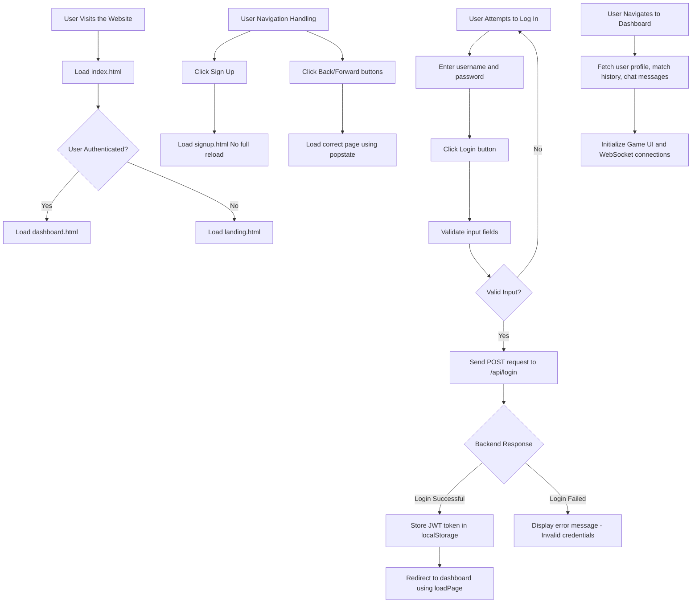

```mermaid
flowchart TD
    A[User Visits the Website] --> B[Load index.html]
    B --> C{User Authenticated?}
    C -->|Yes| D[Load dashboard.html]
    C -->|No| E[Load landing.html]

    F[User Attempts to Log In] --> G[Enter username and password]
    G --> H[Click Login button]
    H --> I[Validate input fields]
    I --> J{Valid Input?}
    J -->|Yes| K[Send POST request to /api/login]
    J -->|No| F

    K --> L{Backend Response}
    L -->|Login Successful| M[Store JWT token in localStorage]
    M --> N[Redirect to dashboard using loadPage]
    L -->|Login Failed| O[Display error message - Invalid credentials]

    P[User Navigation Handling] --> Q[Click Sign Up]
    Q --> R[Load signup.html No full reload]
    P --> S[Click Back/Forward buttons]
    S --> T[Load correct page using popstate]

    U[User Navigates to Dashboard] --> V[Fetch user profile, match history, chat messages]
    V --> W[Initialize Game UI and WebSocket connections]


```
